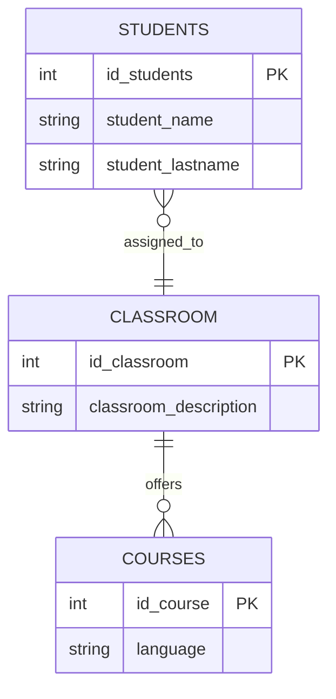
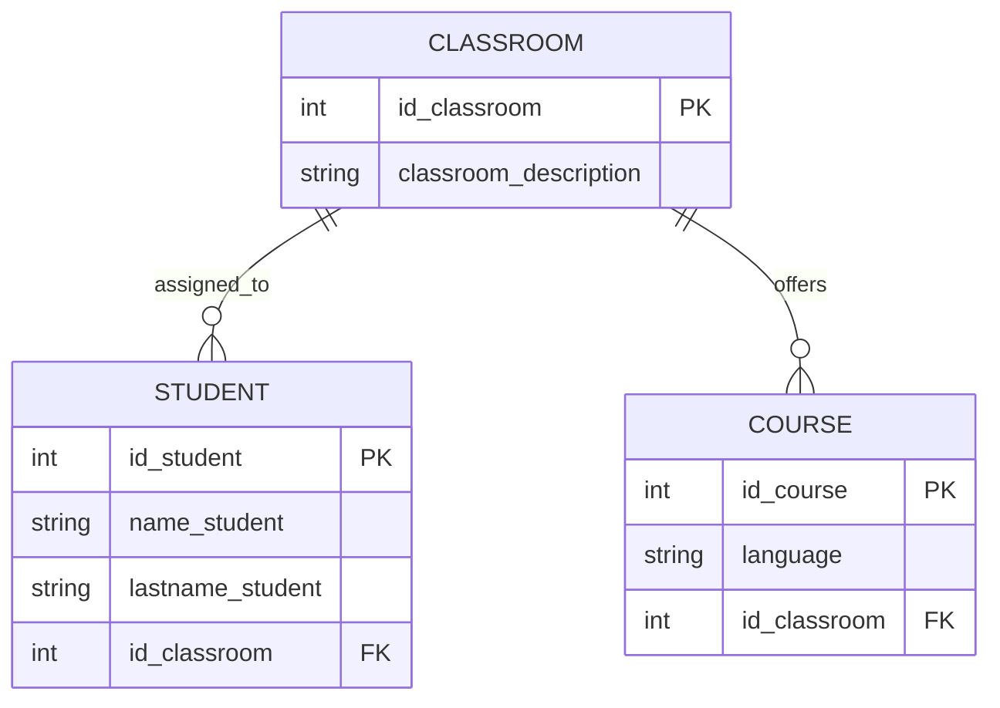

# 📚 Normalización y Modelado de Base de Datos

## 📌 Descripción del ejercicio
A partir de una **tabla de datos sin normalizar** (proporcionada en PDF), se realizó el proceso de **normalización** siguiendo las reglas de las formas normales (1FN, 2FN y 3FN).  

Posteriormente, se construyeron los siguientes entregables:  
1. **Diagrama ER de Chen**  
2. **Diagrama Relacional (patas de gallo)**  
3. **Este precioso README.md**  

El objetivo de esta práctica fue: **mejorar la calidad del modelo de datos**, eliminar redundancias, y garantizar la correcta representación de las entidades y relaciones.

---

## 🛠️ Proceso realizado

### 🔹 Normalización
1. **1FN (Primera Forma Normal):**
   - Se eliminaron los grupos repetitivos.
   - Se definieron atributos atómicos en cada columna.

2. **2FN (Segunda Forma Normal):**
   - Se identificaron claves primarias.
   - Se eliminaron dependencias parciales de la clave.

3. **3FN (Tercera Forma Normal):**
   - Se eliminaron dependencias transitivas.
   - Cada atributo depende únicamente de la clave primaria.

---

## 📐 Diagramas

### 🔹 Diagrama ER (Chen)

---

### 🔹 Diagrama Relacional (Patas de gallo)

---

## 📊 Esquema final de tablas

- **STUDENT**  
  - id_student (PK)  
  - name_student  
  - lastname_student  
  - id_classroom (FK)  

- **CLASSROOM**  
  - id_classroom (PK)  
  - classroom_description  

- **COURSE**  
  - id_course (PK)  
  - language  
  - id_classroom (FK)  

---

## ✅ Conclusiones
- La normalización permitió **eliminar redundancias** y organizar mejor la información.  
- El modelo facilita la **escalabilidad** para añadir más cursos, estudiantes o aulas.  
- La separación de entidades asegura la **integridad referencial** de los datos.  

---
